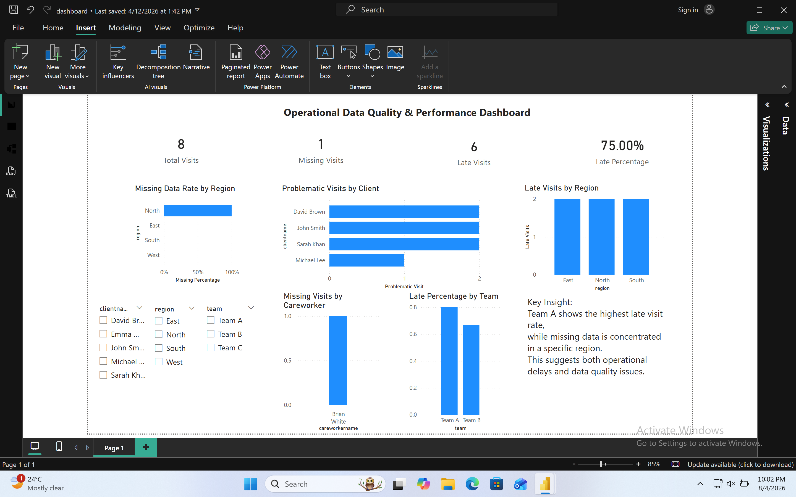

# Healthcare Data Quality Dashboard

## Overview

This project analyses healthcare operational data using SQL and Power BI to monitor data quality and service performance. The dashboard focuses on identifying missing data, late visit reporting and operational risks across clients, careworkers and teams, providing managers with clear insights to support performance monitoring and improve data quality.

Key Features
Identified missing and incomplete records using SQL conditional logic
Analysed late reporting using visit and completion timestamps
Built a relational data model linking visits, clients, and careworkers
Developed a Power BI dashboard with interactive filtering and KPIs
Enabled analysis across team, region, and client dimensions

Key Metrics
Total Visits
Missing Data Rate
Late Visit Rate
Problematic Visits (late OR missing)

Tools Used
SQL (joins, aggregation, CASE WHEN)
Power BI (data modelling, DAX measures, dashboards)
Excel (data preparation)
Business Value

This dashboard helps identify data quality issues and operational inefficiencies, enabling better monitoring of performance and targeted improvements across teams and regions.

## Dashboard Preview

